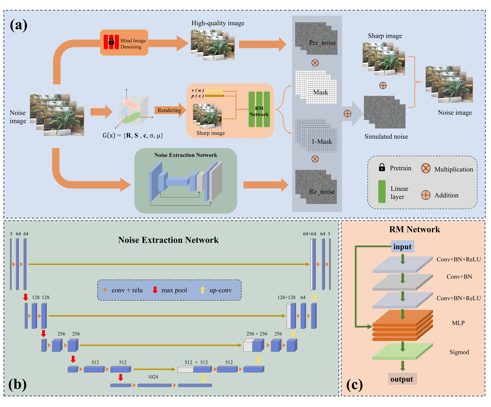
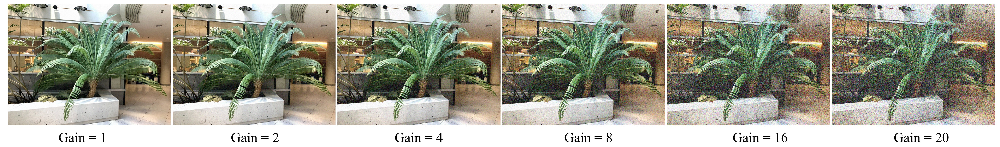
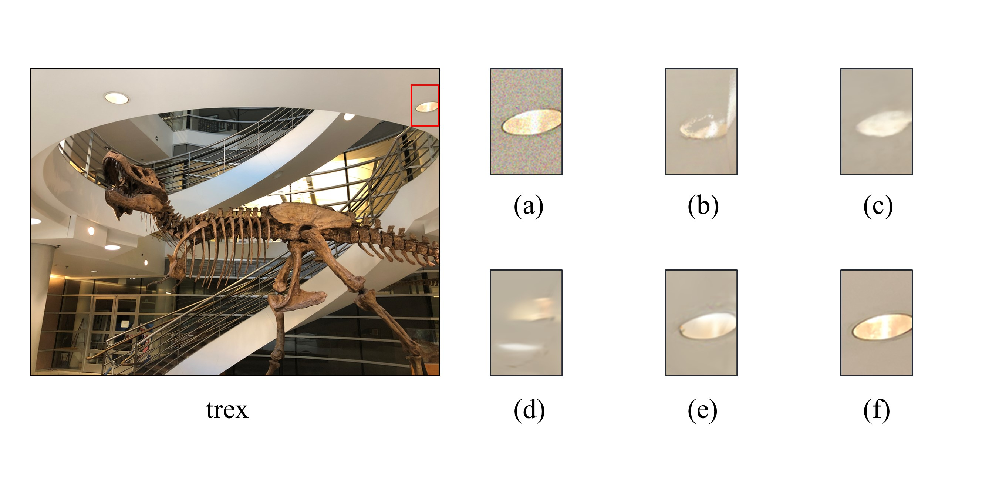
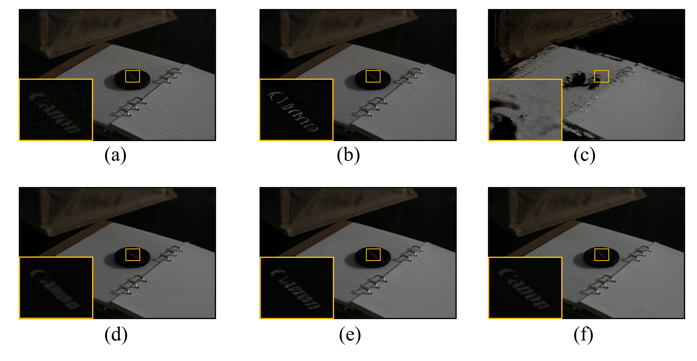

# NAGS: Noise-Aware Gaussian Splatting through Fine-Grained Noise Modeling
 
## Installation
Clone this repository
```
git clone https://github.com/bo1230/NAGS.git
cd NAGS
```

The code is tested with Python3.10, PyTorch==2.1.2+cu118 and cudatoolkit=11.8. To create a conda environment:
```
conda create –n NI python=3.10
conda activate NI
conda install pytorch==2.1.2 torchvision==0.16.2 torchaudio==2.1.2 pytorch-cuda=11.8 -c pytorch -c nvidia
```
For different platforms, the pytorch installation will probably be different.

## Datasets

### Synthesized dataset: 
Reconstructed dataset from [IBRNet](https://github.com/googleinterns/IBRNet) and [LLFF](https://github.com/Fyusion/LLFF).

The clear images in the datasets are noise-added according to the noise model provided by [NAN](https://github.com/NaamaPearl/nan).

Example:
 
The denoised high-quality image is obtained by passing the blind denoising network [Diffbir](https://github.com/XPixelGroup/DiffBIR).

### Real dataset:
Follow the [link](https://pan.quark.cn/s/480dfec7a364) below to download our real dataset. The images in the dataset were taken at night by a Canon 60D.

## Quickly start

```
python train.py --config configs/Real_datasets/bench.txt
```
If you want to view the results, please use the following code and ensure that you have installed TensorBoard

```
tensorboard --logdir=logs/bench
```

## Training
Training with synthetic datasets
```
python train.py --config configs/Synthetic_datasets/gain1/data2_benchflower_gain1.txt
```
Training with real datasets
```
python train.py --config configs/Real_datasets/bench.txt
```

## Result
### Synthesized dataset

Comparison of the "trex" Scene with Other SOTA Methods at Noise Gain 4. (a) Noisy input image, (b) NAN's novel view synthesis result, (c) NeRF-per's novel view synthesis result, (d) 3D GS-pre's novel view synthesis result, (e) Our method's novel view synthesis result, (f) Reference clear view.
### Real dataset:
 
Comparison of Our Method with Other SOTA Methods on the "canon" Scene Captured by a Camera. (a) Noisy input image, (b) Result of the single-view denoising method, (c) NAN's novel view synthesis result, (d) NeRF-per's novel view synthesis result, (f) 3D GS-pre's novel view synthesis result, (f) Our method's novel view synthesis result.

